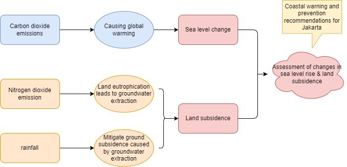
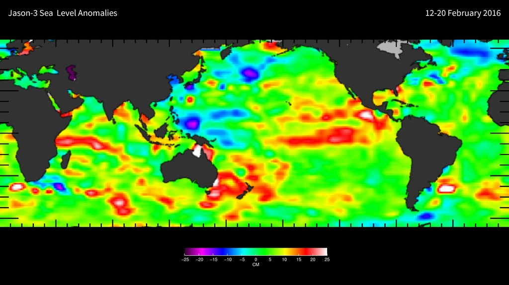

---
output:
  xaringan::moon_reader:
    lib_dir: libs
    nature:
      highlightStyle: github
      highlightLines: true
      countIncrementalSlides: false
      
---
class: center, title-slide,middle
background-image:url("figures/Jakarta3.jpeg")
background-size:cover
background-position: center

# Land Subsidence and Sea Level Rise Analysis in Jakarta
## <br/>CASA0023 Group Presentation
### <br/>Group: Princesses
---
```{r setup, include=FALSE}
library(RefManageR)
library(knitcitations)

options(htmltools.dir.version = FALSE)

# Citing Options
BibOptions(check.entries = FALSE,
           bib.style = "authoryear",
           cite.style = "authoryear",
           style = "markdown",
           hyperlink = TRUE,
           dashed = FALSE,
           no.print.fields=c("doi", "url", "urldate", "issn"))
myBib <- ReadBib("./references.bib", check = FALSE)

```
background-image: url(https://static.nationalgeographic.co.uk/files/styles/image_3200/public/001b_06-20211117-selects.webp?w=1600&h=900)
background-position: 50% 50%
class: center, bottom, inverse

# “In the late afternoon, I used to see people having fun on the beach. There are those who played football and only returned home after sunset,” the 87-year-old recalled fondly “It’s gone … The waves pounded and slowly washed away the sand … It’s sad.” 


---
## Research questions & Goals 

<br/>
<br/>
<br/>

* Investigate the climatic and anthropogenic causes of sea level rise and land subsidence.

* Monitoring and assessment of the causes of abnormal sea level rise and risk analysis.

* Consider limitations and make recommendations to mitigate ground settlement.

---
# Why sea level rise?

```{r echo=FALSE,fig.cap= "Source from:https://en-gb.topographic-map.com/map-tdwf3/Special-Capital-Region-of-Jakarta/?center=-6.65097%2C107.04254"}

knitr::include_graphics('figures/Jakarta.png')

```

---
## Land subsidence and Flooding

```{r echo=FALSE, fig.align='center'}
knitr::include_graphics("figures/Piccc.jpeg")
```
Source from: `r Citet(myBib, 'FIGUEROAMIRANDA201891')`
---

# Loss of vegetation

The picture below shows the evolution of the city over the past three decades. The widespread replacement of forests and other vegetation with impervious surfaces in inland areas along the Ciliwung and Cisadane rivers has reduced how much water the landscape can absorb, contributing to runoff and flash floods.

<div style="display: flex; justify-content: space-around;">
  
  
</div>
---
# Improving Compliance/Adherence with Development Agendas/Goals:
<br/>
<br/>
<br/>
<br/>


Here we find The Agendas: 

Integrated Flood Safety Plan (IFSP)

Strategy for Air Pollution Control (SPPU)


---

# Three methods:

<div style="display: flex; justify-content: space-around;">
  <div style="max-width: 30%; text-align: center; margin-right: 5px;">
    
   <p>Water management to reduce groundwater extraction</p>
</div>
  <div style="max-width: 30%; text-align: center; margin-right: 5px;">
    
    <p>Add more green plants to improve the environment</p>
</div>
  <div style="max-width: 30%; text-align: center; margin-right: 5px;">
    
    <br/>
    <br/>
    <br/>
    <p>Reducing emissions</p>
</div>
---

# Water management to reduce groundwater extraction


<br/>
<br/>

Implementing effective water management to reduce groundwater extraction can align with sustainable urban development goals. As the widespread pumping of groundwater is the human factor of sinking and flooding, it is necessary to pretend residents from doing it and worsen the situation. Jakarta could also mitigate the situation through desalination of seawater in pilot areas.

---

# Add more green plants to improve the environment

<br/>
<br/>

Investing in green infrastructure and planting trees will mitigate subsidence and enhance urban resilience, aligning with global climate action and sustainable city planning. It is obvious from the picture before that the greenery has been replaced by city land.

---
## Benefits of greenery
.pull-left[
<p style="font-size:1.4em;"><br/>A canopy of leaves, branches and trunks slows down the rain before it hits the ground simply by getting in the way. In addition, root systems help water penetrate deeper into the soil at a faster rate under and around trees.`r Citet(myBib, 'WoodlandTrustFlooding')`]

.pull-right[
<br/>
```{r echo=FALSE, out.width='80%', fig.show='hold', fig.align= 'right'}
knitr::include_graphics("https://www.mwmo.org/wp-content/uploads/2017/03/trees-and-stormwater-diagram-basic-v2-nb.png")
```
]
---

# Reducing emissions

<br/>
<br/>

Focusing on 

1) governing air pollution controls

2) reducing emissions from mobile sources

3) reducing emissions from stationary sources
`r Citet(myBib, 'UrbanLinksJakartaPollution')`
---

# Benefits to City and Its Population:

<br/>
<br/>

Reducing land subsidence and controlling sea level rise would mitigate flooding risks, protecting homes and businesses.

Improved infrastructure, like green spaces and flood defenses, can enhance the quality of life, reduce urban heat, and increase biodiversity.

Efficient pollution management and cleaner air would lead to better public health and environmental quality.
---

# Approach
<br/>
<br/>
<br/>


---
class: center, middle
#Data Colloction
---
```{css, echo=FALSE}
.table-slide {
  max-width: 100%; /* Adjust the width as needed */
  margin: 0 auto; /* Center the table */
}
```


| Goal | Data resources | Spatial resolution | Temporal resolution | Data charge | Handling method |
|----------|----------|----------|----------|----------|----------|
|  Carbon dioxide emissions | Our world in data    | t/capita   | per year  |free  | Data Analysis(python) `r Citet(myBib, 'SHUKLA201799')` |
| Nitrogen dioxide emission | Earth Engine Apps | mw | daily | free| N/A |
| Sea level change  | Infrared and microwave sensors Jason-3 | 3cm | near real-time  |free | Data Analysis(python)  |
| Land subsidence | SAR Sentinel 1A  | 10m | weekly | free | Harmonic Analysis, Method of Least Squares `r Citet(myBib, 'siregar2019monitoring')` |
| Rainfall  | Climate Change Knowledge Portal    | mm  | per year  |free  | N/A |
---
# Methodology
<br/>
<br/>

---
#Methodology
##Land subsidence monitoring
<br/>
<br/>
###1.Synthetic Aperture Radar (SAR)
<p style="font-size:1.1em;">SAR technology can provide high-resolution monitoring of surface changes and is especially suitable for monitoring land subsidence. By comparing SAR images at different points in time, small changes in ground elevation can be accurately measured.
---
##Land subsidence monitoring
###2.Interferometric Synthetic Aperture Radar (InSAR):
<p style="font-size:1.1em;">InSAR technology uses the phase difference of two or more SAR images to calculate the ground subsidence rate and can also form an interference pattern. Once the interference pattern is formed, a grid of images is created, one image is selected as the original date, and the changes in other images relative to it are measured. By fitting each time series, the average displacement velocity of each pixel over the desired time interval is obtained. This gives the average annual displacement `r Citet(myBib, 'Moradi2023')` .
<figure>
<figcaption>Example of ground displacement map changes. Source: Moradi et al. (2023)</figcaption>
<figure>
---
##Sea Level Change Monitoring
###Jason3
<p style="font-size:1.0em;">Obtain sea level data from the Jason-3 satellite through NASA, NOAA or related data centers. Jason-3 can accurately measure the height of global sea levels and provide important data for climate change research. Use GIS and analyze this data to identify sea level trends in Jakarta and its surrounding areas. Combining sea level data and climate models to predict sea level changes in Jakarta in the coming years and decades. Assess the potential impacts of sea level rise on Jakarta, including the risk of flooding in low-lying areas, seawater erosion and saltwater intrusion.
<figure>
<figcaption>Example of the first Jason-3 map. Source: `r Citet(myBib, 'NASASeaLevelPortal')`  </figcaption>
<figure>
---

#Project Gantt Chart
<figure>
<figcaption>Gantt Chart of Whole Project. Timeline: 2025.01-2025.10</figcaption>
<figure>
---
# Budget-Employees

---
# Budget-Projects 
<br/>
<br/>
<br/>


---
# Summary
## Final suggestions：
* Keeping using remote sensing to detect land subsidence and sea level rise.
* Setting strict water resource management policies.
* Limiting the exploitation of groundwater.
* Providing more and better green spaces
* Limiting traffic and industrial emissions.

## Final Costs：
£32,000/£50,000  
---
# Risks and Limitations
.pull-left[
  ###Risks:
  
1. Financial Constraints

1. Technical Challenges

1. Environmental Impacts

1. Long-term Sustainability
  
]

.pull-right[
  ###Limitations:
  
1. Slow onset natural disasters cannot be fully solved. 

1. Data time limitations.

  
]
---
###References

```{r results='asis', echo=FALSE}


PrintBibliography(myBib)

```

