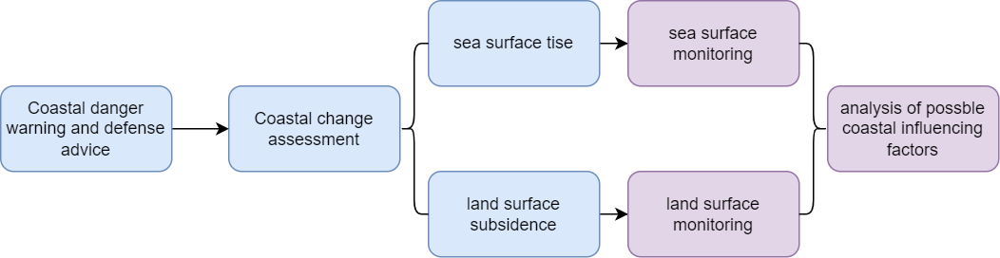

class: center, middle

```{r setup, include=FALSE}
library(RefManageR)
library(knitcitations)

options(htmltools.dir.version = FALSE)

# Citing Options
BibOptions(check.entries = FALSE,
           bib.style = "authoryear",
           cite.style = "authoryear",
           style = "markdown",
           hyperlink = TRUE,
           dashed = FALSE,
           no.print.fields=c("doi", "url", "urldate", "issn"))
myBib <- ReadBib("./references.bib", check = FALSE)

```


# Approach


---
# Methodology


---

```{css, echo=FALSE}
.table-slide {
  max-width: 100%; /* Adjust the width as needed */
  margin: 0 auto; /* Center the table */
}
```


| Goal | Data resources | Spatial resolution | Temporal resolution | Data charge | Handling method |
|----------|----------|----------|----------|----------|----------|
|  Carbon dioxide emissions | Our world in data    | t/capita   | per year  |free  | Data Analysis(python) `r Citet(myBib, 'SHUKLA201799')` |
| Nitrogen dioxide emission | Earth Engine Apps | mw | daily | free| N/A |
| Sea level change  | Infrared and microwave sensors Jason-3 | 3cm | near real-time  |free | Data Analysis(python)  |
| Land subsidence | SAR Sentinel 1A  | 10m | weekly | free | Harmonic Analysis, Method of Least Squares `r Citet(myBib, 'siregar2019monitoring')` |
| Rainfall  | Climate Change Knowledge Portal    | mm  | per year  |free  | N/A |


---

# References

```{r results='asis', echo=FALSE}


PrintBibliography(myBib)

```
