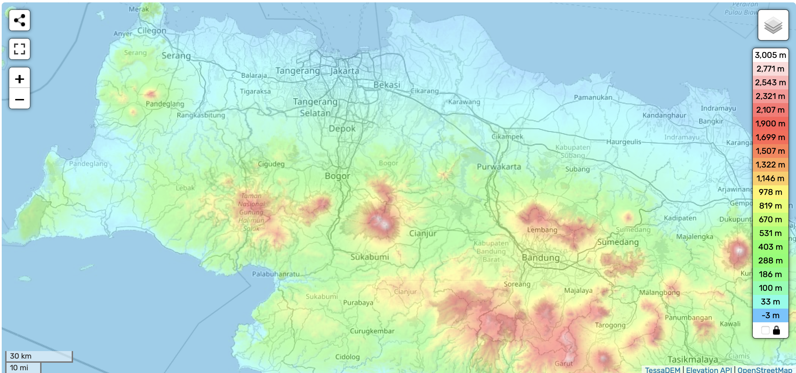
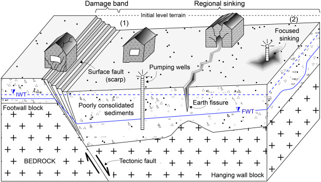

background-image: url(https://static.nationalgeographic.co.uk/files/styles/image_3200/public/001b_06-20211117-selects.webp?w=1600&h=900)
background-position: 50% 50%
class: center, bottom, inverse

# “In the late afternoon, I used to see people having fun on the beach. There are those who played football and only returned home after sunset,” the 87-year-old recalled fondly “It’s gone … The waves pounded and slowly washed away the sand … It’s sad.” 


---
## Research questions & Goals 

<br/>
<br/>
<br/>

* Investigate the climatic and anthropogenic causes of sea level rise and land subsidence.

* Monitoring and assessment of the causes of abnormal sea level rise and risk analysis.

* Consider limitations and make recommendations to mitigate ground settlement.

---
# Why sea level rise?

```{r echo=FALSE,fig.cap= "Source from:https://en-gb.topographic-map.com/map-tdwf3/Special-Capital-Region-of-Jakarta/?center=-6.65097%2C107.04254"}



```

---
## Land subsidence and Flooding

```{r echo=FALSE, fig.align='center', fig.cap="Source from: Figueroa-Miranda et al.(2018)"}

```

---

# Loss of vegetation

The picture below shows the evolution of the city over the past three decades. The widespread replacement of forests and other vegetation with impervious surfaces in inland areas along the Ciliwung and Cisadane rivers has reduced how much water the landscape can absorb, contributing to runoff and flash floods.

<div style="display: flex; justify-content: space-around;">
  
  
</div>
