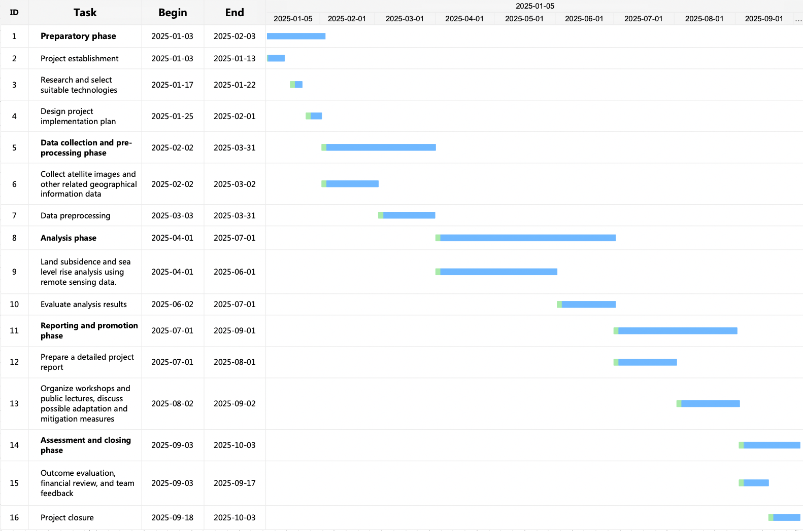

```{r setup, include=FALSE}
options(htmltools.dir.version = FALSE)
knitr::opts_chunk$set(echo = FALSE) 
library(RefManageR)
library(knitcitations)

options(htmltools.dir.version = FALSE)

# Citing Options
BibOptions(check.entries = FALSE,
           bib.style = "authoryear",
           cite.style = "authoryear",
           style = "markdown",
           hyperlink = TRUE,
           dashed = FALSE,
           no.print.fields=c("doi", "url", "urldate", "issn"))
myBib <- ReadBib("./references.bib", check = FALSE)
```
#Methodology
##Sea level rise analysis
###1.Synthetic Aperture Radar (SAR)
<p style="font-size:1.1em;">SAR technology can provide high-resolution monitoring of surface changes and is especially suitable for monitoring land subsidence. By comparing SAR images at different points in time, small changes in ground elevation can be accurately measured.
---
##Land subsidence monitoring
###2.Interferometric Synthetic Aperture Radar (InSAR):
<p style="font-size:1.1em;">InSAR technology uses the phase difference of two or more SAR images to calculate the ground subsidence rate and can also form an interference pattern. Once the interference pattern is formed, a grid of images is created, one image is selected as the original date, and the changes in other images relative to it are measured. By fitting each time series, the average displacement velocity of each pixel over the desired time interval is obtained. This gives the average annual displacement `r Citet(myBib, 'Moradi2023')` .
<figure>
<figcaption>Example of ground displacement map changes. Source: Moradi et al. (2023)</figcaption>
<figure>
---
##Sea Level Change Monitoring
###Jason3
<p style="font-size:1.0em;">Obtain sea level data from the Jason-3 satellite through NASA, NOAA or related data centers. Jason-3 can accurately measure the height of global sea levels and provide important data for climate change research. Use GIS and analyze this data to identify sea level trends in Jakarta and its surrounding areas. Combining sea level data and climate models to predict sea level changes in Jakarta in the coming years and decades. Assess the potential impacts of sea level rise on Jakarta, including the risk of flooding in low-lying areas, seawater erosion and saltwater intrusion.
<figure>
<figcaption>Example of the first Jason-3 map. Source: `r Citet(myBib, 'NASASeaLevelPortal')`  </figcaption>
<figure>
---
#Project Gantt Chart
<figure>
<figcaption>Gantt Chart of Whole Project</figcaption>
<figure>
---
#References

```{r results='asis', echo=FALSE}


PrintBibliography(myBib)

```


