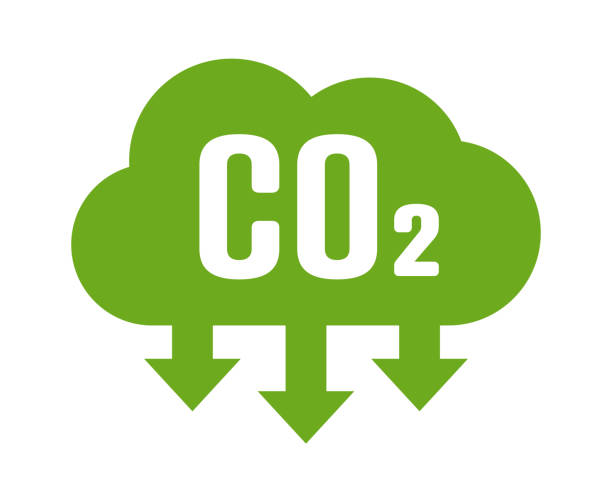

# Improving Compliance/Adherence with Development Agendas/Goals:
 
 
 
 

Here we find The Agendas: 

Integrated Flood Safety Plan (IFSP)

Strategy for Air Pollution Control (SPPU)

---

# Three methods:

  

    
   
Water management to reduce groundwater extraction

  

    
    
Add more green plants to improve the environment

  

    
     
     
     
    
Reducing emissions

---

# Water management to reduce groundwater extraction

 
 

Implementing effective water management to reduce groundwater extraction can align with sustainable urban development goals. As the widespread pumping of groundwater is the human factor of sinking and flooding, it is necessary to pretend residents from doing it and worsen the situation. Jakarta could also mitigate the situation through desalination of seawater in pilot areas.

---

# Add more green plants to improve the environment

 
 

Investing in green infrastructure and planting trees will mitigate subsidence and enhance urban resilience, aligning with global climate action and sustainable city planning. It is obvious from the picture before that the greenery has been replaced by city land.
---

# Reducing emissions

 
 

Focusing on 

1) governing air pollution controls

2) reducing emissions from mobile sources

3) reducing emissions from stationary sources

---

# Benefits to City and Its Population:

 
 

Reducing land subsidence and controlling sea level rise would mitigate flooding risks, protecting homes and businesses.

Improved infrastructure, like green spaces and flood defenses, can enhance the quality of life, reduce urban heat, and increase biodiversity.

Efficient pollution management and cleaner air would lead to better public health and environmental quality.
---
